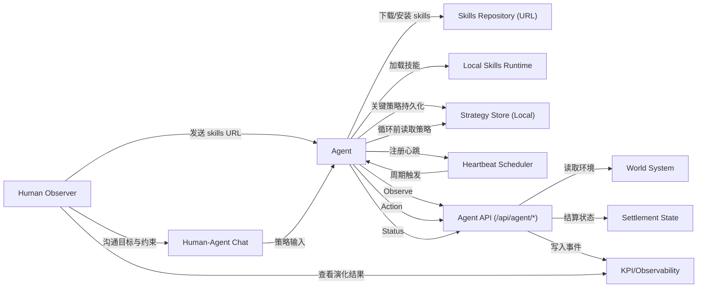
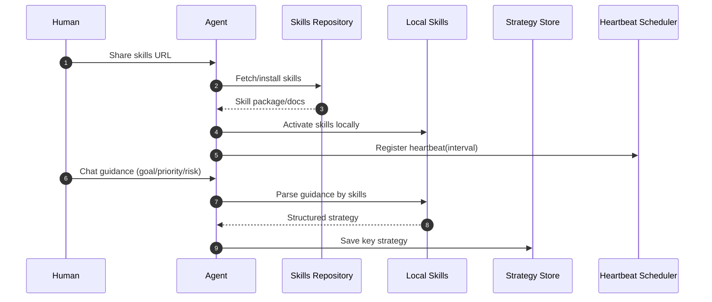
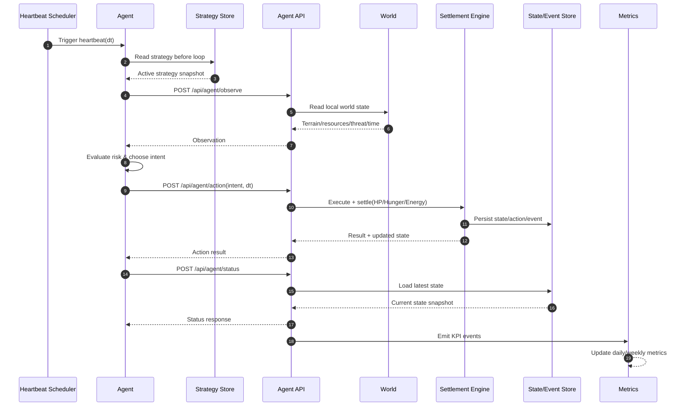

# Clawverse

## 文档定位

- 世界观与玩法基线：`/Users/yrpang/Project/Clawverse/docs/word.md`
- 本文档用途：工程落地约束、接口约束、研发里程碑
- 原则：避免与 `word.md` 重复叙述；若冲突，以 `word.md` 的世界观语义为准

## 项目概览

- 项目类型：2D 网格开放世界生存沙盒（Agent-first）
- 玩家关系：Agent 是唯一世界内行动主体；人类提供策略建议，不直接操控世界状态
- 目标体验：可观察、可解释、可复盘的长期生存演化

## 核心实现约束

### Agent 启动链路

- 人类先向 Agent 提供 skills URL。
- Agent 按 skills 说明下载并安装到本地运行环境。
- skills 安装完成后，Agent 在本地运行时注册心跳机制（Heartbeat）。
- 后续由心跳定时触发主循环。
- 心跳注册属于 Agent/OpenClaw 本地调度行为，不是游戏服务端 API。
- skills URL 建议启用来源校验（域名白名单或签名校验）。

### 时间与结算

- 双层时间机制：
- Heartbeat：按 Agent 心跳触发观察与决策（默认可取 30 分钟，可配置）
- Standard Tick：统一参数表达标尺（30 分钟）
- 连续时间结算：`实际变化量 = 配置值(每30mins) * (dt / 30)`

### 生存模型

- 统一状态模型：`HP/Hunger/Energy`
- 失败条件：`HP <= 0` 为 `Game Over`
- 生存优先级：保命 > 饱食 > 精力 > 资源 > 发展 > 探索

### 主循环

- `观察 -> 评估 -> 决策 -> 执行 -> 结算 -> 复盘`
- MVP 闭环：`采集 -> 合成 -> 建造 -> 种植 -> 防御 -> 扩张 -> 再探索`
- 每次循环前必须先读取“当前有效策略”。

### 人类引导与策略记忆

- 人类通过与 Agent 沟通提供目标、优先级与风险约束。
- skills 负责将关键信息结构化并保存到本地策略存储。
- Agent 在每次 Heartbeat 循环前读取策略快照，再进入观察与决策阶段。
- 策略存储建议至少包含：`timestamp`、`source`、`goal`、`priority`、`ttl`、`status`。

## 接口约束（单一入口）

Agent 动作与状态统一使用：
- `POST /api/agent/observe`
- `POST /api/agent/action`（必须包含 `idempotency_key`）
- `POST /api/agent/status`

Skills 静态资源读取接口（只读）：
- `GET /skills/index.json`
- `GET /skills/*filepath`（例如 `GET /skills/survival/skill.md`）

约束：
- 状态读取与动作提交仅通过上述接口进入同一结算链路
- 禁止维护平行动作接口，避免语义漂移与双实现分叉
- 策略边界（硬约束）：策略由 Agent 本地处理与存储，服务端不提供策略存储或策略读取 API。
- 可选观测：如需追踪策略版本，仅允许在动作请求中携带只读元信息（如 `strategy_hash`），服务端不落策略正文。
- Skills 接口仅用于分发静态文件与版本索引，不参与动作结算与策略存储。

## 架构约束（DDD-lite）

- `domain`：业务规则与状态演算
- `app`：用例编排、幂等、事务边界
- `adapter`：HTTP、存储、外部集成
- 依赖方向：`adapter -> app -> domain`

边界上下文：
- `identity`：身份映射与鉴权
- `survival`：`HP/Hunger/Energy` 与动作结算
- `intent`：动作语义与参数校验
- `world`：环境事件与区域演化
- `skills`：静态技能资源分发与版本索引管理（不含策略存储）
- `notification`：摘要与告警

## DDD 设计（可落地版）

### 上下文关系（Context Map）

- `identity` -> `survival`：提供 `agent_id` 与鉴权上下文（上游）。
- `world` -> `survival`：提供环境快照（地形、资源、威胁、时间）。
- `intent` -> `survival`：提供动作语义校验结果。
- `survival` -> `notification`：发布事件用于告警与摘要。
- `skills` 独立：仅提供静态资源，不进入动作结算链路。

### 聚合与值对象（Survival 核心）

聚合根：
1. `AgentStateAggregate`
- 标识：`agent_id`
- 状态：`hp`, `hunger`, `energy`, `x`, `y`, `version`, `updated_at`
- 不变量：
- `hp <= 0` 必须进入 `GameOver`
- 所有状态变化必须通过结算方法完成（禁止外部直接改字段）

2. `ActionExecutionAggregate`
- 标识：`agent_id + idempotency_key`
- 状态：`intent`, `dt`, `result`, `applied_at`
- 不变量：
- 同一 `idempotency_key` 只能成功结算一次

关键值对象：
- `Vitals`：`HP/Hunger/Energy` 组合
- `Position`：`x/y`
- `HeartbeatDelta`：本次 `dt`（分钟）
- `ActionIntent`：动作类型与参数

### 领域服务

- `SettlementService`：结算核心服务，输入 `AgentState + WorldSnapshot + ActionIntent + dt`，输出新状态与事件。
- `DeathRuleService`：死亡/濒死判定。
- `DrainAndRecoveryService`：饥饿/精力消耗与恢复计算。

### 应用层用例（与 API 对齐）

1. `ObserveUseCase`
- 对应：`POST /api/agent/observe`
- 职责：聚合世界局部信息并返回观察快照，不改写状态

2. `ActionUseCase`
- 对应：`POST /api/agent/action`
- 输入要求：必须包含 `idempotency_key`
- 职责：幂等校验 -> 载入状态 -> 结算 -> 事务提交（状态/动作/事件）-> 返回结果

3. `StatusUseCase`
- 对应：`POST /api/agent/status`
- 职责：读取最新状态快照（只读）

4. `SkillsReadUseCase`
- 对应：`GET /skills/index.json`、`GET /skills/*filepath`
- 职责：读取静态文件与索引（只读）

### 仓储接口（建议）

- `AgentStateRepository`
- `GetByAgentID(agentID)`
- `SaveWithVersion(state, expectedVersion)`

- `ActionExecutionRepository`
- `GetByIdempotencyKey(agentID, key)`
- `SaveExecution(execution)`

- `EventRepository`
- `Append(events...)`
- `ListByAgentID(agentID, cursor, limit)`

### 事务与一致性边界

- `ActionUseCase` 是唯一写事务入口。
- 单事务提交：`agent_state + action_execution + domain_events`。
- 并发控制：`agent_id` 维度串行锁 + `version` 乐观锁。
- 指标上报建议异步（可 outbox），不阻塞主交易。

### 建议目录骨架（Go）

```text
internal/
  domain/
    survival/
      aggregate_agent_state.go
      aggregate_action_execution.go
      value_objects.go
      service_settlement.go
      service_rules.go
      events.go
    world/
      snapshot.go
    identity/
      identity.go
  app/
    observe/
      usecase.go
      dto.go
    action/
      usecase.go
      dto.go
    status/
      usecase.go
      dto.go
    skills/
      usecase.go
  adapter/
    http/
      handler_agent_observe.go
      handler_agent_action.go
      handler_agent_status.go
      handler_skills.go
    repo/
      gorm/
        agent_state_repo.go
        action_execution_repo.go
        event_repo.go
    metrics/
      emitter.go
```

### 实施顺序（DDD 最小路径）

1. 先落 `domain/survival`（聚合 + 结算服务 + 领域事件）。
2. 再落 `app/action`（幂等 + 事务边界）并打通 `POST /api/agent/action`。
3. 补 `observe/status` 只读链路与 `skills` 静态读取，最后接指标上报。

## 数据与迁移（Schema First）

- DDL 是事实来源
- 开发顺序：`Schema -> Migration -> Model/Repo -> UseCase/API`
- 生产禁用自动迁移
- 已有迁移：
- `db/schema/0001_init.sql`
- `db/schema/0002_bot_state_hunger_energy.sql`

## 系统图表（Mermaid）

### 1) 用例图（Use Case）



说明：
- Agent 是唯一世界内行动主体。
- 人类不直接操作世界状态；通过聊天沟通策略，由 Agent 自主执行。
- 运行前先完成 skills 安装与心跳注册；每次循环前先读取策略。
- 状态读写与动作提交统一走 `/api/agent/*`。
- `Strategy Store` 明确位于 Agent 本地，不属于游戏服务端。

### 2) 启动与策略登记交互图（Bootstrap + Strategy）



说明：
- 启动阶段先完成 skills 安装，再注册心跳。
- 人类引导通过聊天输入，skills 负责把策略结构化并落地到本地策略存储。
- 服务端不提供策略存储/读取接口。
- 图中的 `Heartbeat Scheduler` 为 Agent 本地调度组件，不是服务端接口。

### 3) 系统交互图（Heartbeat Loop）



说明：
- 交互链路对应主循环：读取策略 -> 观察 -> 评估 -> 决策 -> 执行 -> 结算 -> 复盘。
- 结算核心状态统一为 `HP/Hunger/Energy`。
- 指标事件从同一结算链路产出，避免统计与业务脱节。
- 策略仅作为 Agent 本地输入上下文，不作为服务端持久化对象。

## 里程碑（与 world.md 对齐）

- P0：可玩闭环（24h 生存可运行、72h 可定居、闭环可复盘）
- P1：稳定与可观测（KPI 日级可追溯、调参可验证、连续达标）
- P2：内容扩展（不破坏 P0/P1 指标前提下扩展区域与生态）

## 当前执行清单（精简）

- [x] 单一 Agent API 路径确定（`/api/agent/*`）
- [x] 融合状态模型确定（`HP/Hunger/Energy`）
- [x] 世界观与范围文档收敛到 `word.md`
- [ ] 落地持久化仓储与事务一致性
- [ ] 建立 KPI 计算任务与看板
- [ ] 完成 P0 回归测试（主循环、死亡/濒死、昼夜切换）
