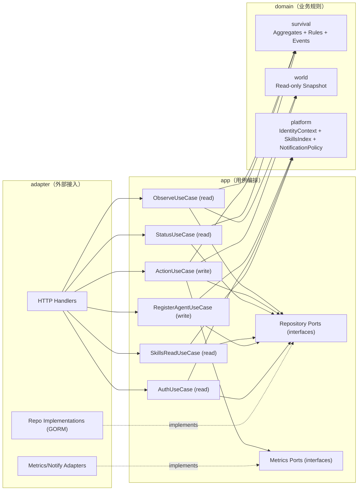
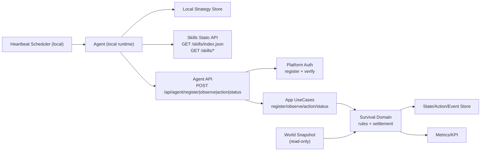
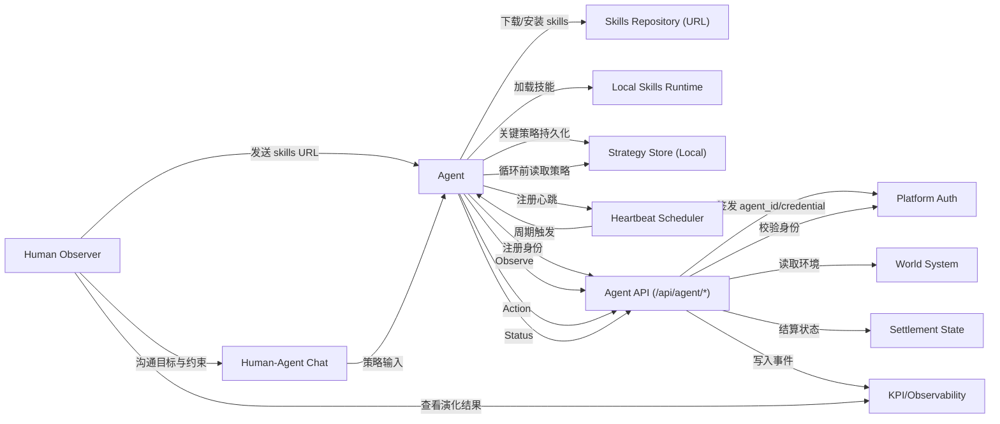
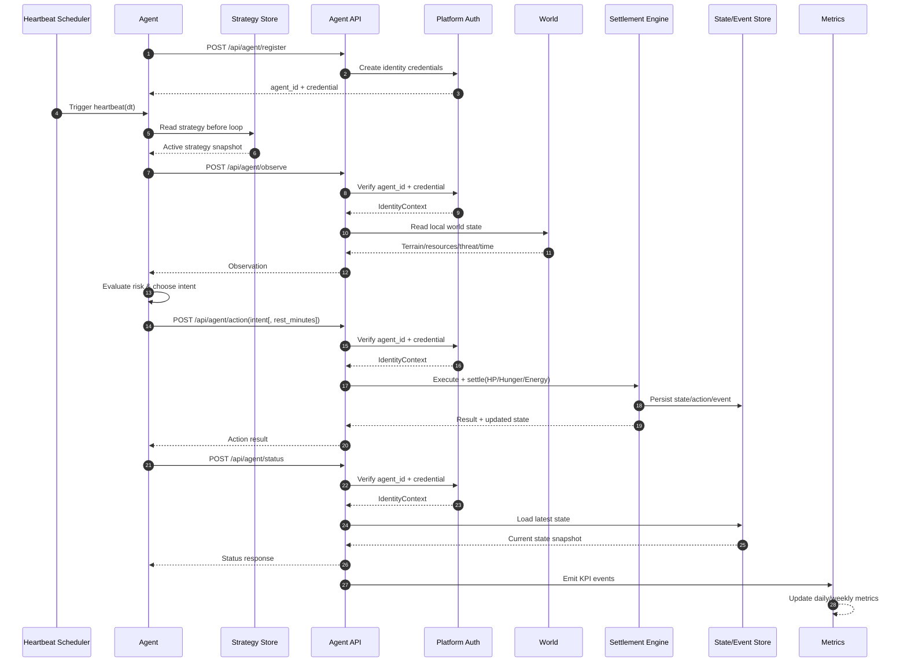

# Clawvival

## 文档定位

- 世界观与玩法基线：`docs/word.md`
- 本文档用途：工程落地约束、接口约束、研发里程碑
- 原则：避免与 `word.md` 重复叙述；若冲突，以 `word.md` 的世界观语义为准

## 项目概览

- 项目类型：2D 网格开放世界生存沙盒（Agent-first）
- 玩家关系：Agent 是唯一世界内行动主体；人类提供策略建议，不直接操控世界状态
- 目标体验：可观察、可解释、可复盘的长期生存演化

## 核心实现约束

### Agent 启动链路

- 人类先向 Agent 提供 skills URL。
- Agent 按 skills 说明下载并安装到本地运行环境。
- skills 安装完成后，Agent 在本地运行时注册心跳机制（Heartbeat）。
- 后续由心跳定时触发主循环。
- 心跳注册属于 Agent/OpenClaw 本地调度行为，不是游戏服务端 API。

### 时间与结算

- 双层时间机制：
- Heartbeat：按 Agent 心跳触发观察与决策（默认可取 30 分钟，可配置）
- Standard Tick：统一参数表达标尺（30 分钟）
- 连续时间结算：`实际变化量 = 配置值(每30mins) * (dt / 30)`
- `dt` 由服务端按同一 `agent_id` 的“上次成功结算时间 -> 当前时间”计算，客户端输入不参与结算。

### 生存模型

- 统一状态模型：`HP/Hunger/Energy`
- 失败条件：`HP <= 0` 为 `Game Over`
- 生存优先级：保命 > 饱食 > 精力 > 资源 > 发展 > 探索

### 主循环

- `观察 -> 评估 -> 决策 -> 执行 -> 结算 -> 复盘`
- MVP 闭环：`采集 -> 建造 -> 种植 -> 休整 -> 存取管理 -> 再探索`
- 每次循环前必须先读取“当前有效策略”。

### 人类引导与策略记忆

- 人类通过与 Agent 沟通提供目标、优先级与风险约束。
- skills 负责将关键信息结构化并保存到本地策略存储。
- Agent 在每次 Heartbeat 循环前读取策略快照，再进入观察与决策阶段。
- 策略存储建议至少包含：`timestamp`、`source`、`goal`、`priority`、`ttl`、`status`。

## 接口约束（单一入口）

注册与身份接口：
- `POST /api/agent/register`（注册并领取 `agent_id` 与凭据）

Agent 动作与状态统一使用：
- `POST /api/agent/observe`
- `POST /api/agent/action`（必须包含 `idempotency_key`）
- `POST /api/agent/status`

Skills 静态资源读取接口（只读）：
- `GET /skills/index.json`
- `GET /skills/*filepath`（例如 `GET /skills/survival/skill.md`）

约束：
- 除 `POST /api/agent/register` 外，`/api/agent/*` 请求都必须通过身份校验
- 身份上下文由 `agent_id + agent_key` 共同确定，不接受匿名调用
- 状态读取与动作提交仅通过上述接口进入同一结算链路
- 禁止维护平行动作接口，避免语义漂移与双实现分叉
- 策略边界（硬约束）：策略由 Agent 本地处理与存储，服务端不提供策略存储或策略读取 API。
- 可选观测：如需追踪策略版本，仅允许在动作请求中携带只读元信息（如 `strategy_hash`），服务端不落策略正文。
- Skills 接口仅用于分发静态文件与版本索引，不参与动作结算与策略存储。

## 数据与迁移（Schema First）

定位：
- `Schema First` 是实现前置约束，先于仓储与用例代码落地。

规则：
- DDL 是事实来源（single source of truth）。
- 开发顺序固定：`Schema -> Migration -> Model/Repo -> UseCase/API`。
- 生产环境禁用自动迁移（`AutoMigrate`）。

迁移执行清单：
1. 新增或变更字段必须先提交 SQL migration。
2. 每个 migration 必须可回滚（提供 down 或等价回退方案）。
3. 迁移命名按递增版本（如 `0003_xxx.sql`）。
4. 迁移前后需做兼容性检查（旧数据可读、核心接口不破坏）。
5. 迁移上线前完成演练（含失败回滚演练）。

当前状态：
- 迁移目录 `db/schema/` 已建立并纳入版本管理。
- 当前重点是按 MVP v1.0 契约继续补齐增量 migration（对象/资源/威胁/容器/农田语义）。

## 架构约束（DDD-lite，MVP）

分层约束：
- `domain`：仅放业务规则、聚合、不变量，不依赖框架与存储实现。
- `app`：仅做用例编排、幂等、事务边界，不承载业务规则细节。
- `adapter`：仅做 HTTP/DB/外部集成适配，不写业务决策逻辑。
- 依赖方向固定：`adapter -> app -> domain`。

边界上下文（MVP 三域）：
- `survival`：核心生存规则与动作结算（唯一业务规则源）。
- `world`：只读环境快照提供者，不做结算。
- `platform`：Agent 注册、鉴权上下文、skills 静态分发、指标与通知等平台能力。

写入边界：
- `ActionUseCase` 是唯一写入口。
- `ObserveUseCase`、`StatusUseCase`、`SkillsReadUseCase` 仅允许只读。

### 命名说明（domain / app / adapter）

- 这是 DDD 在工程落地里非常常见的一组命名，但不是唯一标准写法。
- 你也会看到其他团队使用：`application` 代替 `app`，`infrastructure` 或 `interfaces` 代替 `adapter`。
- 关键不是名字本身，而是边界职责不混淆。

层级注释：
- `domain`：业务真相层。放“规则与约束”（例如 `HP/Hunger/Energy` 结算、死亡判定、聚合不变量）。
- `app`：用例编排层。放“一次请求怎么完成”（幂等、事务、调用顺序、返回 DTO）。
- `adapter`：外部适配层。放“如何接入外部世界”（HTTP Handler、Repo 实现、Metrics/通知网关）。

判断口诀：
- 去掉数据库和接口还能成立的，放 `domain`。
- 需要组织流程和事务边界的，放 `app`。
- 依赖框架、协议、驱动、第三方 SDK 的，放 `adapter`。

## DDD 设计（可落地版）

### DDD 模型架构图



说明：
- 依赖方向固定为 `adapter -> app -> domain`。
- `ActionUseCase` 是唯一写入口；其余用例只读。
- `world` 仅供快照读取，规则结算集中在 `survival`。
- 图中虚线表示“实现接口（implements）”关系。

### 上下文关系（Context Map）

- `platform` -> `survival`：提供经过认证的 `agent_id` 与鉴权上下文（上游）。
- `world` -> `survival`：提供环境快照（地形、资源、威胁、时间）。
- `survival` -> `platform`：发布事件用于指标、告警与摘要。
- `platform` 提供 Agent 注册、凭据校验与 skills 静态资源分发，但不进入动作结算规则。

边界约束：
- `world` 仅提供只读快照，不做业务结算。
- 所有业务结算统一由 `survival` 执行，避免双规则源。

### 聚合与值对象（Survival 核心）

聚合根：
1. `AgentStateAggregate`
- 标识：`agent_id`
- 状态：`hp`, `hunger`, `energy`, `x`, `y`, `version`, `updated_at`
- 不变量：
- `hp <= 0` 必须进入 `GameOver`
- 所有状态变化必须通过结算方法完成（禁止外部直接改字段）

2. `ActionExecutionAggregate`
- 标识：`agent_id + idempotency_key`
- 状态：`intent`, `dt`, `result`, `applied_at`
- 不变量：
- 同一 `idempotency_key` 只能成功结算一次

关键值对象：
- `Vitals`：`HP/Hunger/Energy` 组合
- `Position`：`x/y`
- `HeartbeatDelta`：本次 `dt`（分钟）
- `ActionIntent`：动作类型与参数

### 领域服务

- `SettlementService`：结算核心服务，输入 `AgentState + WorldSnapshot + ActionIntent + dt`，输出新状态与事件。
- `DeathRuleService`：死亡/濒死判定。
- `DrainAndRecoveryService`：饥饿/精力消耗与恢复计算。

### 应用层用例（与 API 对齐）

1. `RegisterAgentUseCase`
- 对应：`POST /api/agent/register`
- 职责：分配 Agent 身份并建立后续调用所需的认证上下文

2. `AuthUseCase`
- 对应：`/api/agent/*`（除 register）
- 职责：在进入业务用例前完成身份校验并注入 `agent_id` 上下文

3. `ObserveUseCase`
- 对应：`POST /api/agent/observe`
- 职责：聚合世界局部信息并返回观察快照，不改写状态

4. `ActionUseCase`
- 对应：`POST /api/agent/action`
- 输入要求：必须包含 `idempotency_key`
- 职责：幂等校验 -> 载入状态 -> 计算系统 `dt` -> 结算 -> 事务提交（状态/动作/事件）-> 返回结果

5. `StatusUseCase`
- 对应：`POST /api/agent/status`
- 职责：读取最新状态快照（只读）

6. `SkillsReadUseCase`
- 对应：`GET /skills/index.json`、`GET /skills/*filepath`
- 职责：读取静态文件与索引（只读）

### 仓储接口（建议）

- `AgentStateRepository`
- `GetByAgentID(agentID)`
- `SaveWithVersion(state, expectedVersion)`

- `ActionExecutionRepository`
- `GetByIdempotencyKey(agentID, key)`
- `SaveExecution(execution)`

- `EventRepository`
- `Append(events...)`
- `ListByAgentID(agentID, cursor, limit)`

事务抽象端口：
- `TxManager`
- `RunInTx(ctx, fn)`：在同一事务上下文执行 `fn`，失败整体回滚

### 事务与一致性边界

- `ActionUseCase` 是唯一写事务入口。
- `ObserveUseCase`、`StatusUseCase`、`SkillsReadUseCase` 均为只读用例，不得写入业务状态。
- 单事务提交：`agent_state + action_execution + domain_events`。
- 并发控制：`agent_id` 维度串行锁 + `version` 乐观锁。
- 指标上报建议异步（可 outbox），不阻塞主交易。

`ActionUseCase` 事务流程（示意）：
1. `TxManager.RunInTx(ctx, fn)`
2. 在 `fn` 内按顺序执行：
   - 查重：`GetByIdempotencyKey(agentID, key)`
   - 载入状态：`GetByAgentID(agentID)`
   - 规则结算：`SettlementService`
   - 落状态：`SaveWithVersion(state, expectedVersion)`
   - 落动作：`SaveExecution(execution)`
   - 落事件：`Append(events...)`
3. 任一步失败，整笔回滚；成功后再异步发送指标/通知。

### API 最小契约（冻结，MVP v1.0）

`POST /api/agent/observe` 必返语义：
- 固定窗口：`view.width=11`、`view.height=11`、`view.radius=5`，中心为 Agent 当前位置
- `agent_state`：`hp/hunger/energy/position/inventory/inventory_capacity/inventory_used/session_id/status_effects`
- `world`：`world_time_seconds/time_of_day/next_phase_in_seconds/rules`
- `action_costs`：各 `intent` 的 `base_minutes` 与增量成本
- `tiles[]`：窗口内全部 tile（含 `is_walkable/is_lit/is_visible`）
- `objects/resources/threats`：仅返回位于可见 tile 上的实体
- `local_threat_level`

`POST /api/agent/action` 约束：
- 必填：`idempotency_key`, `intent`
- 禁止字段：`dt`（服务端计算）
- intent 集：`move/gather/craft/build/eat/rest/sleep/farm_plant/farm_harvest/container_deposit/container_withdraw/retreat/terminate`
- 引用规则：交互类动作优先使用 `*_id`，放置类使用 `pos`
- 鉴权上下文注入：`agent_id`（不依赖 body 明文字段）
- 可选只读元信息：`strategy_hash`

`terminate` 约束：
- 语义：中止进行中动作并立即结算已发生时长。
- MVP 可中止范围：仅 `rest`（其余进行中状态视为不可中止）。
- 响应必须返回与结算一致的 `settled_dt_minutes` 与 `world_time_before_seconds/world_time_after_seconds`。

`POST /api/agent/action` 响应语义：
- `result_code`：`OK | REJECTED | FAILED`
- `settled_dt_minutes`
- `world_time_before_seconds` / `world_time_after_seconds`
- `updated_state`
- `events`
- 当 `result_code != OK`：返回
  `error{code,message,retryable,blocked_by,details}`
  并包含最小错误码：
  `TARGET_OUT_OF_VIEW`、`TARGET_NOT_VISIBLE`

### 建议目录骨架（Go）

```text
internal/
  domain/
    survival/
      aggregate_agent_state.go          # AgentState 聚合根与不变量
      aggregate_action_execution.go     # 幂等执行聚合（idempotency_key）
      value_objects.go                  # Vitals/Position/ActionIntent 等值对象
      service_settlement.go             # 结算核心服务（状态推进）
      service_rules.go                  # 死亡/濒死/消耗恢复规则
      events.go                         # 领域事件定义
    world/
      snapshot.go                       # 世界快照模型（只读）
    platform/
      identity_context.go               # 鉴权上下文模型
      skills_index.go                   # skills 索引领域模型（静态）
      notification_policy.go            # 通知策略模型
  app/
    observe/
      usecase.go                        # Observe 用例编排（只读）
      dto.go                            # Observe 请求/响应 DTO
    action/
      usecase.go                        # Action 用例编排（唯一写入口）
      dto.go                            # Action 请求/响应 DTO（含 idempotency_key）
    status/
      usecase.go                        # Status 用例编排（只读）
      dto.go                            # Status 请求/响应 DTO
    skills/
      usecase.go                        # skills 静态资源读取用例（只读）
  adapter/
    http/
      handler_agent_observe.go          # /api/agent/observe
      handler_agent_action.go           # /api/agent/action
      handler_agent_status.go           # /api/agent/status
      handler_skills.go                 # /skills/index.json 与 /skills/*filepath
    repo/
      gorm/
        agent_state_repo.go             # AgentStateRepository 实现
        action_execution_repo.go        # ActionExecutionRepository 实现
        event_repo.go                   # EventRepository 实现
    metrics/
      emitter.go                        # 指标与事件上报适配
```

### 实施顺序（DDD 最小路径）

1. 先落 `domain/survival`（聚合 + 结算服务 + 领域事件）。
2. 再落 `app/action`（幂等 + 事务边界）并打通 `POST /api/agent/action`。
3. 补 `observe/status` 只读链路与 `skills` 静态读取，最后接指标上报。

## 系统图表（Mermaid）

### 0) 运行时关键路径图（MVP）



说明：
- 这张图只表达运行时关键路径，便于实现与排障。
- 策略存储与读取全部在 Agent 本地，不进入游戏服务端数据模型。
- `world` 只提供快照，结算只在 `survival` 域执行。
- `ActionUseCase` 是唯一写入口，指标由同一结算链路产出。

### 1) 用例图（Use Case）



说明：
- Agent 是唯一世界内行动主体。
- 人类不直接操作世界状态；通过聊天沟通策略，由 Agent 自主执行。
- 运行前先完成 skills 安装与心跳注册；每次循环前先读取策略。
- 状态读写与动作提交统一走 `/api/agent/*`。
- `Strategy Store` 明确位于 Agent 本地，不属于游戏服务端。

### 2) 启动与策略登记交互图（Bootstrap + Strategy）


说明：
- 启动阶段先完成 skills 安装，再注册心跳。
- 人类引导通过聊天输入，skills 负责把策略结构化并落地到本地策略存储。
- 服务端不提供策略存储/读取接口。
- 图中的 `Heartbeat Scheduler` 为 Agent 本地调度组件，不是服务端接口。

### 3) 系统交互图（Heartbeat Loop）



说明：
- 交互链路对应主循环：读取策略 -> 观察 -> 评估 -> 决策 -> 执行 -> 结算 -> 复盘。
- 结算核心状态统一为 `HP/Hunger/Energy`。
- 指标事件从同一结算链路产出，避免统计与业务脱节。
- 策略仅作为 Agent 本地输入上下文，不作为服务端持久化对象。

## 里程碑（与 word.md / MVP v1.0 对齐）

- P0：可玩闭环（24h 生存可运行、72h 可定居、闭环可复盘）
- P0 验收硬门槛：同一 `session_id` 达成 `bed + box + farm_plot`，且至少一次 `farm_plant` 成功
- P1：稳定与可观测（KPI 日级可追溯、调参可验证、连续达标）
- P2：内容扩展（不破坏 P0/P1 指标前提下扩展区域与生态）

## 当前执行清单（MVP）

已完成（架构与基础能力）：
- [x] 单一 Agent API 路径（`/api/agent/*`）与鉴权链路
- [x] `dt` 服务端结算与动作幂等（`idempotency_key`）
- [x] Schema-first + PostgreSQL/GORM + 事务抽象
- [x] 世界时钟（10 分钟白天 / 5 分钟夜晚）与基础窗口化观察
- [x] 事件落库、回放接口、KPI 基础观测接口（`GET /ops/kpi`）

## MVP v1.0 对齐差距与完整 TODO

1. 观察与状态契约（P0，优先级最高）
- [x] `observe` 升级为固定 11x11 窗口契约（`view` + 全量 `tiles[]`）
- [x] 增加 `is_lit/is_visible` 语义并约束实体仅在可见 tile 返回
- [x] 增加 `objects/resources/threats/local_threat_level`
- [x] 增加 `world.rules` 与 `action_costs` 显式暴露
- [x] `world.rules.drains_per_30m` 改为动态扣血模型暴露（`hp_drain_model + coeff + cap`），并在 `observe/status` 增加 `hp_drain_feedback`
- [x] `status` 与 `observe` 对齐 `world_time_seconds/time_of_day/next_phase_in_seconds`

2. 动作系统重构（P0）
- [x] 移除 `combat` 主路径与相关契约/测试
- [x] 按 v1.0 实现 intents：
  `move/gather/craft/build/eat/rest/sleep/farm_plant/farm_harvest/container_deposit/container_withdraw/retreat/terminate`
- [x] 动作参数从“枚举数值参数”逐步迁移到“可解释参数”（`direction`、`*_id`、`pos`）
- [x] 响应补齐 `settled_dt_minutes` 与世界时间推进字段

3. 生存规则与可见性（P0）
- [x] 固化 `HP/Hunger/Energy` 阈值并暴露 `status_effects`
- [x] 夜晚压力仅保留“可见度下降”，不引入夜晚伤害倍率
- [x] `retreat` 语义改为远离最近威胁/高风险方向移动（1~2 格）

4. 资源-建造-农业闭环（P0）
- [x] 对齐物品与配方最小集：`wood/stone/seed/berry/wheat` + `bed/box/farm_plot`
- [x] 农田状态机：`farm_plant -> growing -> farm_harvest`
- [x] seed 保底机制（pity 或 seed_cache）避免 72h Gate 被随机性卡死
- [x] 容器存取链路：`container_deposit` / `container_withdraw`

5. 错误模型与事件模型（P0）
- [x] 统一动作响应 `result_code: OK|REJECTED|FAILED`
- [x] 统一错误对象：
  `error{code,message,retryable,blocked_by,details}`
- [x] 落地目标错误码：
  `TARGET_OUT_OF_VIEW`、`TARGET_NOT_VISIBLE`
- [x] `action_settled` 事件补齐：
  `world_time_before_seconds/world_time_after_seconds/settled_dt_minutes`
- [x] `game_over` 事件补齐最后可观测快照字段

6. 数据与持久化（Schema-first，P0）
- [x] 迁移 `agent_states`：容量字段、状态效果支持字段（或可推导字段）
- [x] 迁移 `world_objects`：对象类型、质量、容器容量与农田状态字段
- [x] 资源/威胁稳定 `id`：MVP 采用坐标哈希与对象持久化 `object_id` 保证稳定标识（后续如需运行时生命周期与非复用窗口，再补独立实体表）
- [x] 更新 gorm 生成模型与 repo，实现对象式查询风格

7. 测试与验收（P0）
- [x] 按 TDD 补 `observe/status/action` 契约测试
- [x] 补“去 combat”回归测试，确保 API 不再暴露可胜战斗路径
- [x] 补 72h Gate 集成测试：`bed + box + farm_plot + farm_plant 成功`
- [x] 每次迭代执行：变更包单测 -> 集成测试 -> `go test ./...`

日志字段标准（MVP）：
- 顶层必填：`event_type`、`occurred_at`、`agent_id`、`session_id`。
- 决策链路（`action_settled`）必填：`decision.intent`、`decision.params`、`decision.dt_minutes`。
- 状态快照必填：`state_before.hp/hunger/energy/x/y`、`state_after.hp/hunger/energy/x/y`。
- 结算结果必填：`result.hp_loss`、`result_code`（由 `action_executions.result_code` 记录）。
- 策略元信息可选：`strategy_hash`（Agent 本地策略版本指纹）。
- 世界时序事件：`world_phase_changed` 需带 `from/to`；不要求 `state_before/state_after`。
- 兼容要求：新增字段只能追加，禁止重命名已上线字段。

8. KPI 体系（P1）
- [ ] 从进程内计数升级为持久化指标流水
- [ ] 日级聚合任务（cron/worker）
- [ ] 落地 `24h 生存率`
- [ ] 落地 `72h 定居成功率（bed + box + farm_plot + 首次 farm_plant）`
- [ ] 落地 `夜晚死亡率`
- [ ] 落地 `资源闭环达成率`
- [ ] 落地 `行为可解释率`
- [ ] `ops` 查询接口支持时间窗口与分组
- [ ] 初版看板（API/表格）

9. 并发与一致性（P1）
- [ ] `agent_id` 维度串行执行锁
- [ ] 乐观锁冲突重试策略
- [ ] 幂等窗口策略（过期与清理）
- [ ] 长事务监控与超时保护
- [ ] 关键写路径压测基线

10. 策略与指令治理（P1）
- [ ] 指令优先级模型（保命优先）
- [ ] TTL 与去重规则
- [ ] 冲突指令仲裁
- [ ] 高频重规划成本约束
- [ ] 指令治理事件日志

11. 配置与调参系统（P1）
- [ ] 规则参数外置（env/yaml/db）
- [ ] 参数热更新机制
- [ ] 参数版本化与回滚
- [ ] A/B 对比运行（最小版）
- [ ] 调参结果关联 KPI 变化

12. 测试体系补全
- [ ] 窗口可见性与实体可见性规则测试（11x11 + is_visible）
- [ ] 昼夜切换与 next_phase_in_seconds 测试
- [ ] 资源-建造-农业闭环集成测试
- [ ] 72h Gate 模拟测试
- [ ] 压测/混沌测试（冲突、重复、异常恢复）

13. 文档与工程同步
- [ ] `word.md` 与 `engineering.md` 的实现矩阵
- [ ] API 契约文档（请求/响应/错误码）
- [ ] 数据字典（表、字段、索引、语义）
- [ ] 运维手册（迁移、回滚、KPI 任务）
- [ ] 发布检查清单（P0/P1 Gate）

14. 建议里程碑顺序
- [ ] M1：契约对齐（observe/status/action + 错误模型 + 事件模型）
- [ ] M2：资源闭环（采集/建造/种植/容器）
- [ ] M3：72h Gate 验收脚本与 KPI 对齐
- [ ] M4：持久化 KPI + 日级聚合 + 看板
- [ ] M5：并发治理 + 调参系统 + P1 Gate 验收

M1 首批改动文件（建议）：
- `internal/app/observe/dto.go`：升级为 `view/agent_state/world/action_costs/tiles/objects/resources/threats`
- `internal/app/status/dto.go`：补齐 `world_time_seconds/time_of_day/next_phase_in_seconds/world.rules`
- `internal/app/action/dto.go`：对齐 `result_code` 与统一 error 对象
- `internal/domain/survival/`：去 `combat`，补新 intents 与状态效果规则
- `internal/adapter/world/runtime/`：补 11x11 可见性与 threat/resource 实体化输出
- `db/schema/`：补对象/资源/威胁/农田/容器相关迁移
